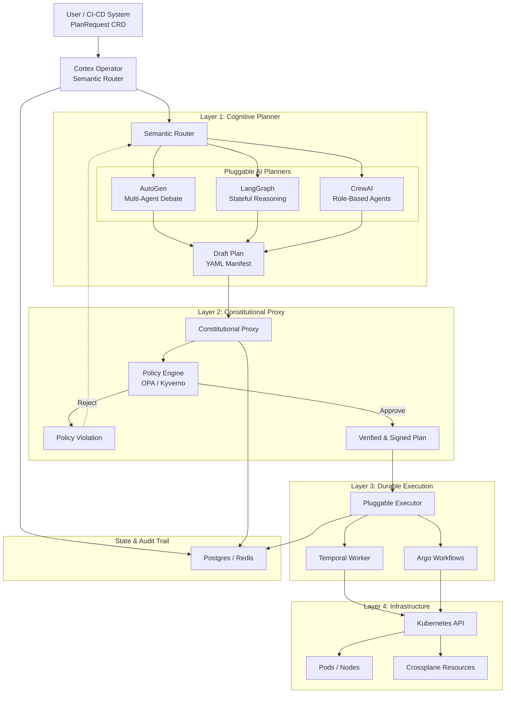

# KubeCortex
A Vendor-Neutral Protocol for Constitutional Agentic Control Planes. Defining the Cognitive Agent Interface (CAI) for Kubernetes.
# KubeCortex
> **A Vendor-Neutral Protocol for Constitutional Agentic Control Planes.**

[](https://opensource.org/licenses/Apache-2.0)
[](https://goreportcard.com/report/github.com/YOUR_USERNAME/kubecortex)
[](https://landscape.cncf.io/) *<-- (Only add "Sandbox" once accepted, use "Candidate" for now)*

---

**KubeCortex** defines the **Cognitive Agent Interface (CAI)**, a standard protocol that allows any AI Agent (AutoGen, LangGraph, CrewAI) to safely negotiate with Kubernetes clusters via a "Constitutional Proxy."

It solves the **"Black Box"** problem in Agentic Infrastructure by wrapping probabilistic AI reasoning in deterministic safety policies (OPA/Kyverno).

## 🏗 Architecture
* **Protocol:** CAI (Cognitive Agent Interface)
* **Safety:** The Constitutional Proxy (Sidecar)
* **State:** Pluggable Durable Backend (Default: Temporal)



## 🚀 Quick Start
KubeCortex is designed to run on any Kubernetes cluster (Kind, Minikube, EKS, GKE).

```bash
# 1. Install the KubeCortex Operator
helm repo add kubecortex [https://charts.kubecortex.io](https://charts.kubecortex.io)
helm install cortex-operator kubecortex/operator

# 2. Submit your first Intent
kubectl apply -f examples/intent-high-availability.yaml
