# 🛡️ KubeAegis
### Agentic Infrastructure for Kubernetes

> **Chat with your cluster.** Bridge the gap between natural language intent and high-security infrastructure.


---

## 📖 Overview
**KubeAegis** is an AI-powered Kubernetes Operator that functions as an intelligent infrastructure agent. Instead of writing complex YAML boilerplate manually, operators interact with Aegis using natural language.

Unlike standard "copilots," KubeAegis runs **inside your cluster** as a secure controller, maintaining state and context. It uses a **Hybrid Brain** architecture, supporting both cloud-based LLMs (OpenAI GPT-4) for power and local models (Ollama/Llama 3) for air-gapped security.

## 🚀 Key Features
* **🗣️ Natural Language Interface:** Command your cluster: *"Deploy a highly available Redis cluster with 3 replicas."*
* **🧠 "Human-in-the-Loop" Workflow:** The AI generates a plan, but *you* have the final say. Review, Refine, or Reject via the CLI.
* **🛡️ Security First:**
    * Built on **Google Distroless** images (Rootless, no shell, 95% smaller attack surface).
    * Full **RBAC** integration.
    * Production-grade **Secret Management** for AI keys.
* **⚡ Native CLI:** Includes `aegis`, a standalone Go binary for seamless interaction.

## 🏗️ Architecture

```mermaid
sequenceDiagram
    participant User as 👤 Platform Eng
    participant CLI as 💻 Aegis CLI
    participant K8s as ☸️ K8s API
    participant Ctrl as 🛡️ Aegis Controller
    participant AI as 🧠 AI Brain (OpenAI/Ollama)

    User->>CLI: "Create an Nginx pod"
    CLI->>K8s: Creates PlanRequest (CRD)
    K8s->>Ctrl: Reconcile Loop Triggered
    Ctrl->>AI: Sends Context + Intent
    AI->>Ctrl: Returns YAML Manifest
    Ctrl->>K8s: Updates Status with Plan
    CLI->>User: Shows Plan & Asks for Approval
    User->>CLI: [A]pply / [R]efine
    CLI->>K8s: Applies Manifest
```



## 🛠️ Installation

### Prerequisites
* Kubernetes Cluster (Kind, Minikube, GKE, EKS)
* `kubectl` configured
* OpenAI API Key (or local Ollama instance)

### 1. Deploy the Operator
```bash
# Install Custom Resource Definitions (CRDs)
make install

# Deploy the Controller (Pre-built Distroless Image)
make deploy IMG=ghcr.io/kgemmanuel/kubeaegis-controller:v0.1.0
```

### 2. Configure the Brain
Inject your API key into the secure cluster secret:
```bash
kubectl create secret generic openai-secret \
    --namespace=kubeaegis-system \
    --from-literal=OPENAI_API_KEY=sk-YOUR-REAL-KEY
```

### 3. Install the CLI
```bash
go build -o bin/aegis cmd/aegis/main.go
```

## 💡 Usage Example

**1. Generate a Plan**
```bash
./bin/aegis plan "Deploy a Postgres database with persistent storage"
```

**2. Refine the Result (Interactive Mode)**
> **Aegis:** *Generates standard Postgres Deployment*
>
> **❓ What would you like to do? [A]pply / [R]efine / [Q]uit:** R
> **📝 Feedback:** "Add resource limits: 500m cpu and 512Mi memory"
>
> **Aegis:** *Regenerates YAML with limits applied*
>
> **❓ What would you like to do? [A]pply / [R]efine / [Q]uit:** A
> **🚀 Applying plan to cluster...**
> **✅ Deployment Successful!**

## 🔮 Roadmap
* [x] **Q1 2026:** Core Controller, Cloud Deployment, CLI V1
* [ ] **Q2 2026:** RAG Integration (Cluster-aware context)
* [ ] **Q3 2026:** Auto-Healing Agents (Log analysis & self-repair)

---
*Built with ❤️ in Québec City by **Kaldjob Guillaume Emmanuel**.*
